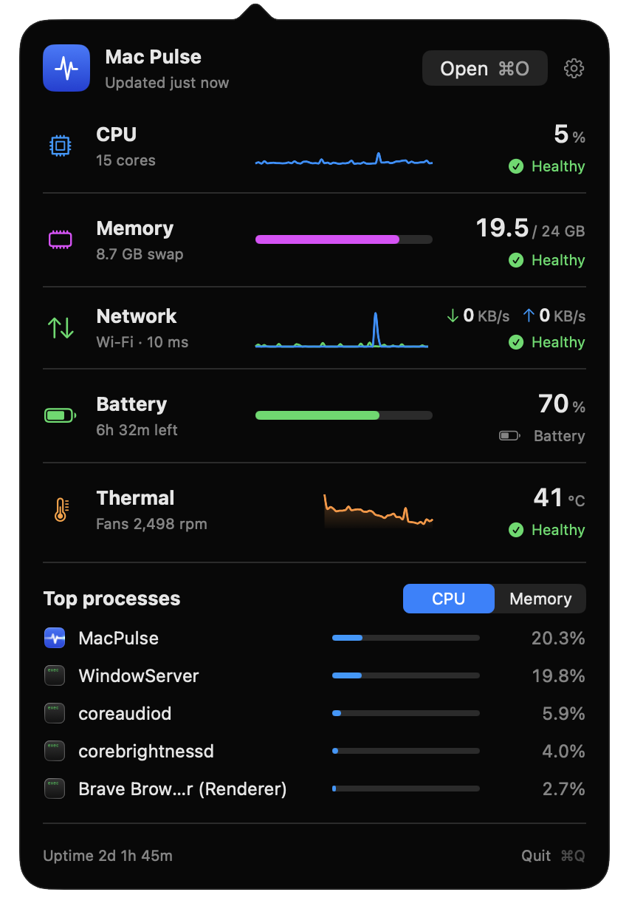
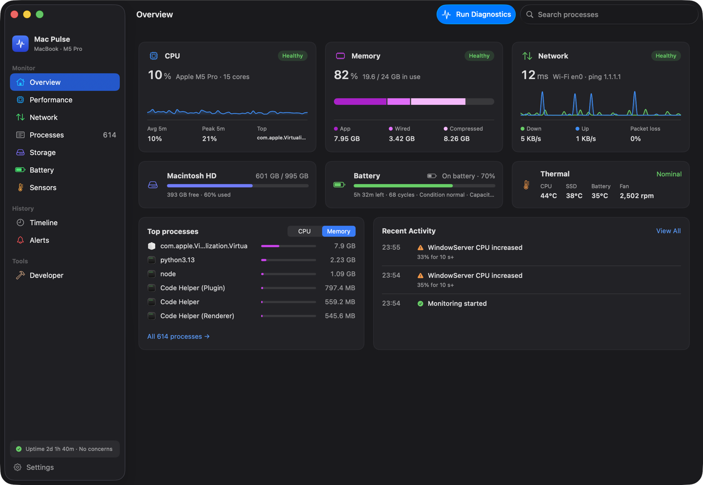
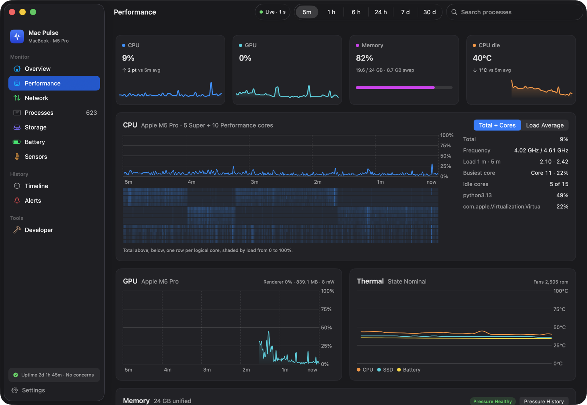
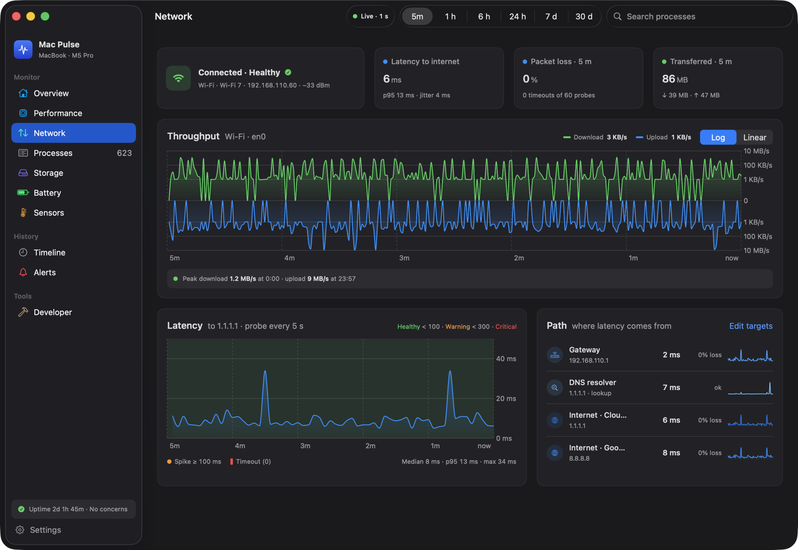
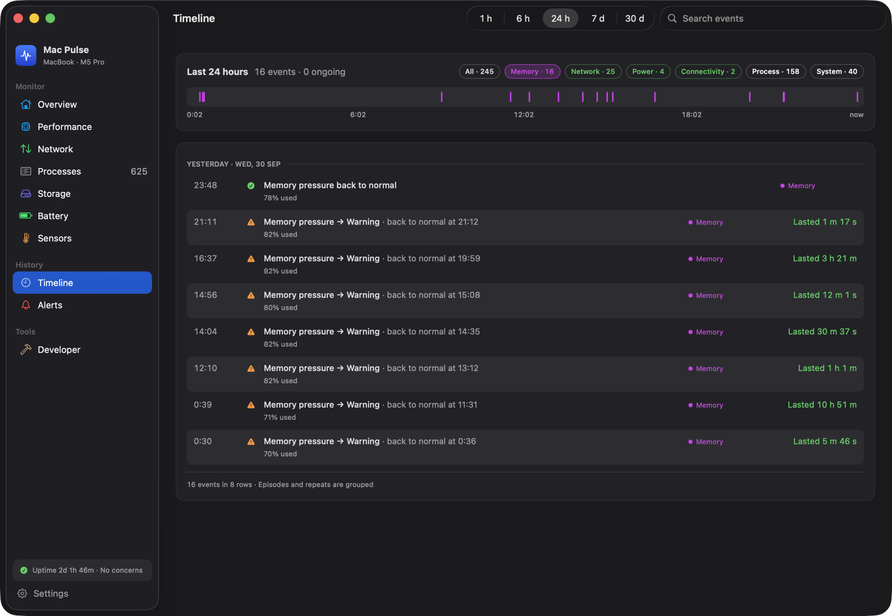
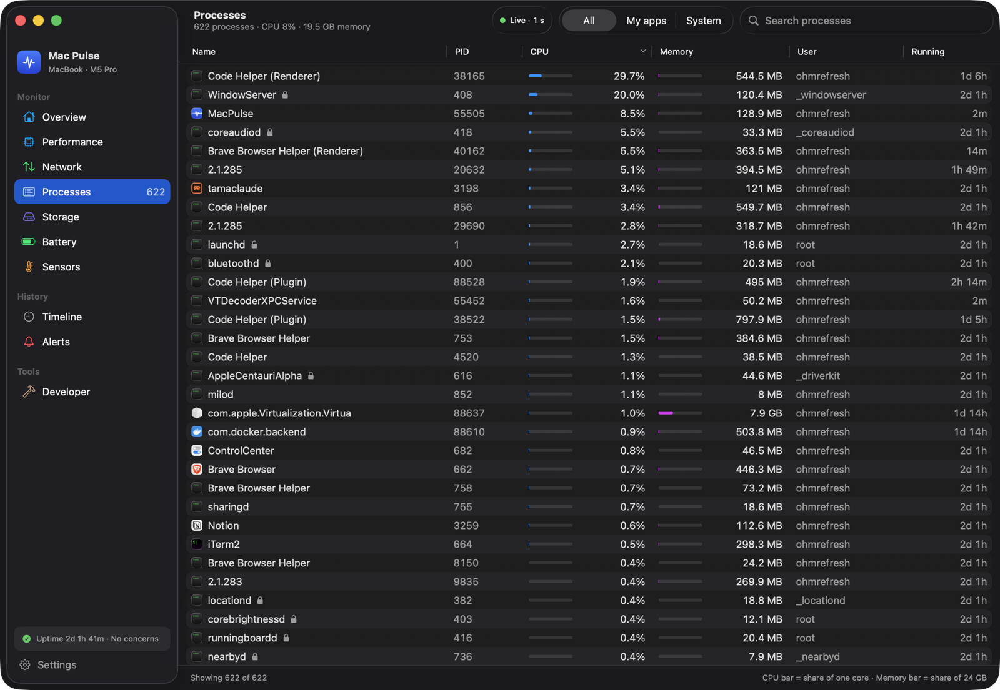
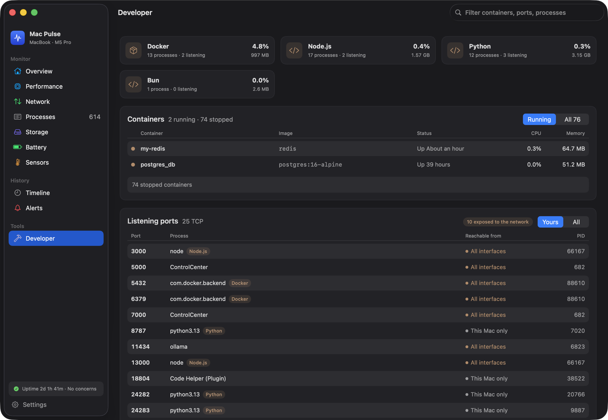
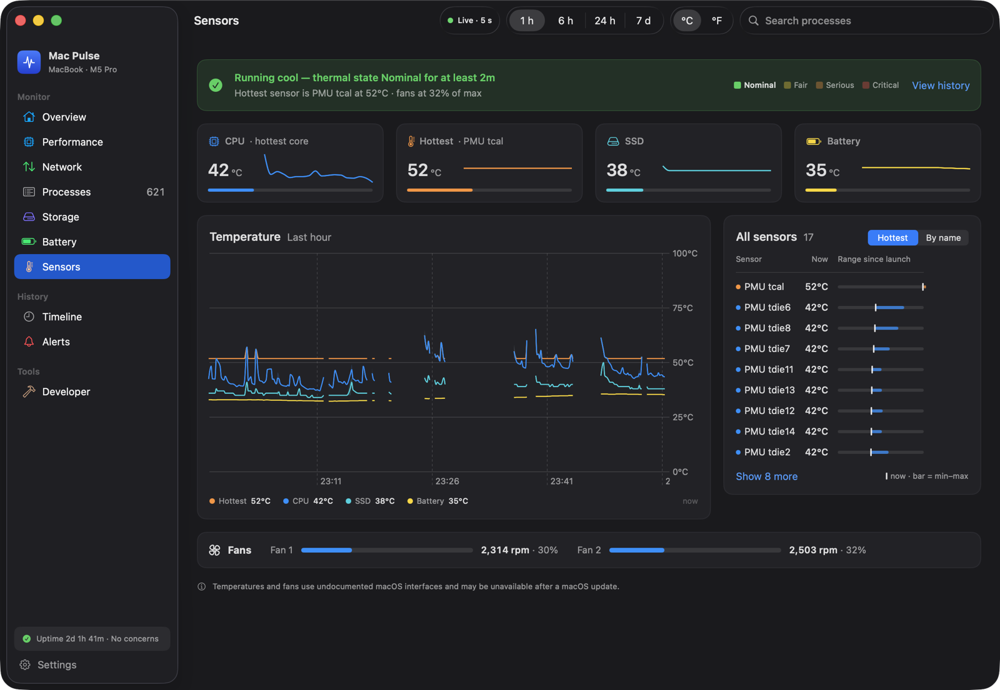
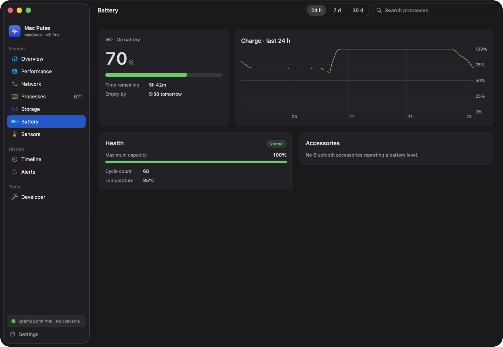
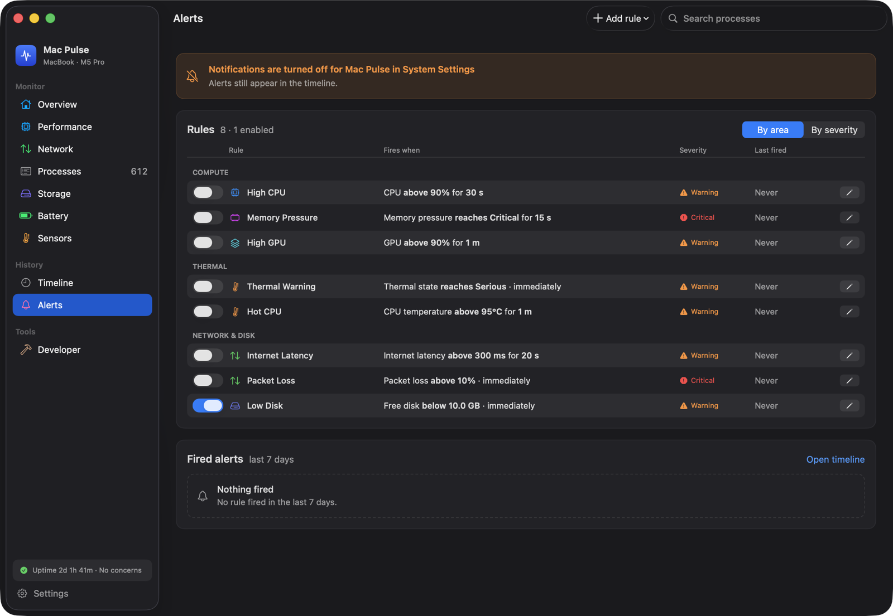

# Mac Pulse

A macOS menu-bar system monitor that answers one question the built-in tools do not: **what is happening to my Mac, when did it start, and what is likely causing it.**

[](https://github.com/ohmrefresh/mac-pulse/actions/workflows/ci.yml)



Activity Monitor shows the present instant. Mac Pulse keeps history, marks when things changed, and offers deterministic diagnostics — so you can get from "my Mac feels wrong" to a specific, checkable cause.

## What it does

It works at three levels, and you can stop at whichever one answers your question.

**Menu bar.** An always-visible status item with up to eight segments you pick in Settings — CPU, memory, network throughput, internet latency, battery, thermal state, CPU temperature and GPU. No sparklines, no colour; it is meant to be read at a glance and otherwise ignored.


**Popover.** One click gives you CPU, memory, network and temperature — plus battery on Macs that have one — each with a recent sparkline and a Health Level badge, followed by the Top Processes by CPU.

**Dashboard.** Ten sections for when the popover is not enough: Overview, Performance, Network, Processes, Developer, Storage, Battery, Sensors, Timeline and Alerts.

Beyond live numbers, it:

- records history and re-buckets it into charts across Live, 1 h, 6 h, 24 h, 7 d and 30 d;
- writes Timeline Events so you can see *when* something changed, not just that it is wrong now, and joins each warning to its recovery so you can see how long it lasted;
- runs Diagnostics (⌘R) over the last 15 minutes plus a fresh probe burst, where every Finding states **Observed**, **Possible cause** and **Recommendation**;
- rolls readings into a Health Level so the summary says what is wrong before showing you six equal cards;
- shows temperatures in °C or °F — one setting for the menu bar, popover and dashboard.

Causes are offered as likely or possible — suggestions, not certainties. A value this Mac cannot report is hidden rather than dashed or guessed.

## Screenshots

### Overview

CPU, Memory and Network lead as cards; disk, battery and thermal follow as tiles, then the top processes beside recent activity. When something needs attention, a banner above them says what.



### Performance

A tile per metric, then total CPU over a per-core heatmap, GPU and Thermal charts. CPU frequency and GPU power are read through IOReport.



### Network

Connection, latency, packet loss and traffic, a mirrored throughput chart, latency banded by your own thresholds, and the path from gateway to each internet target.



### Timeline

Every change is a Timeline Event; a warning and its recovery are one row that says how long it lasted.



### Processes, Developer, Sensors, Battery and Alerts

| | |
| --- | --- |
|  |  |
|  |  |
|  | |

## Requirements

- macOS 14 or later.
- Developed and tested on Apple silicon. Temperature, fan, CPU frequency and GPU power come from interfaces that are specific to it; on hardware or a macOS version that does not report them, those rows are hidden and everything else still works.
- To build: Xcode and [XcodeGen](https://github.com/yonaskolb/XcodeGen).

## Build and run

`MacPulse.xcodeproj` is generated and is not checked in — change `project.yml` and regenerate, never edit the project file.

```sh
brew install xcodegen
xcodegen generate
xcodebuild -project MacPulse.xcodeproj -scheme MacPulse -derivedDataPath .build/xcode build
open .build/xcode/Build/Products/Debug/MacPulse.app
```

Tests for everything outside the UI live in the `MacPulseKit` package:

```sh
cd Packages/MacPulseKit
swift test
```

`scripts/package.sh` builds a DMG. With a `DEVELOPER_ID` and a notary profile it signs, notarizes and staples; **without them it produces an ad-hoc local build only**, which is not something you can hand to anyone else.

## Permissions and privacy

Mac Pulse is a single process. No daemon, no cloud, no account, no telemetry.

- **It is not sandboxed**, by design ([ADR 0001](docs/adr/0001-distribute-outside-app-store-unsandboxed.md)). The sandbox would cut off a complete process list, the Docker socket, listening ports and network configuration — the things it exists to show you.
- **Processes** are read directly for your own user, and the rest come from `/bin/ps`, because an unprivileged app cannot read root and system processes. There is no privileged helper.
- **Temperatures and fans** ([ADR 0002](docs/adr/0002-private-apis-for-temperature-and-fans.md)) and **CPU frequency and GPU power** ([ADR 0003](docs/adr/0003-ioreport-for-cpu-frequency-and-gpu-power.md)) come from private, undocumented interfaces. They fail soft: a failure yields a hidden row, never a crash or a wrong number, and nothing else depends on them.
- **Notifications** are requested only when you first enable an Alert Rule. All rule templates ship disabled.
- **A login item** is registered only when the app is running from `/Applications`.
- **Network** activity is an ICMP ping to the one to four internet targets you set in Settings (IPv4, IPv6 or a hostname; 1.1.1.1 and 8.8.8.8 by default, and a hostname is resolved at most every five minutes), plus a UDP DNS query for a fixed popular name sent to your Mac's own configured resolver — the point is to time *your* resolver, not to look anything up. The public IP lookup is **off by default** and, when enabled, only ever contacts 1.1.1.1.
- **History** is stored locally in `~/Library/Application Support/MacPulse/history.sqlite`, with retention you choose from 1 hour to 30 days, and it can be cleared from Settings.
- **Wi-Fi network changes are deliberately not tracked**, because that would require Location Services.

## Status

Pre-release, version 0.2.0. The menu bar, popover, dashboard, history, timeline, alerts and diagnostics all work — see the [changelog](CHANGELOG.md).

Disk images are on the [Releases](https://github.com/ohmrefresh/mac-pulse/releases) page; each release's notes say whether that build is signed and notarized. An ad-hoc signed build is blocked on first launch: right-click Mac Pulse in Applications and choose Open. You can also build from source.

## Docs

| Document | What it covers |
| --- | --- |
| [CONTEXT.md](CONTEXT.md) | The glossary. The vocabulary used throughout the app and these docs |
| [PRODUCT.md](PRODUCT.md) | Who it is for, what it is for, and the tone it takes |
| [DESIGN.md](DESIGN.md) | The design system — colour, hierarchy, and what the interface refuses to do |
| [docs/adr/](docs/adr/) | Decisions that are hard to reverse, and why they were made |
| [PRD](docs/prd/Mac%20Pulse%20%E2%80%94%20Product%20Requirements%20Document%20%28PRD%29.md) | The full product requirements |
| [CLAUDE.md](CLAUDE.md) | Architecture, commands and invariants for working in this repo |
